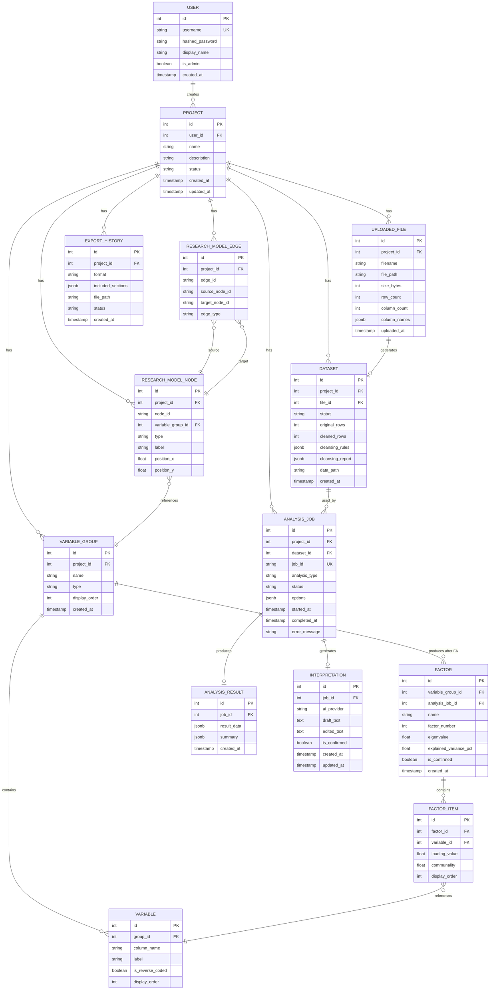

# 데이터 모델

> 본 문서는 PostgreSQL 기반 데이터 모델의 ERD와 테이블 스키마를 정의한다.

---

## 1. ERD (Entity Relationship Diagram)



---

## 2. 테이블 스키마 상세

### 2.1 users

| 컬럼 | 타입 | 제약 | 설명 |
|---|---|---|---|
| id | SERIAL | PK | |
| username | VARCHAR(50) | UNIQUE, NOT NULL | 로그인 ID |
| hashed_password | VARCHAR(255) | NOT NULL | bcrypt 해시 |
| display_name | VARCHAR(100) | | 표시 이름 |
| is_admin | BOOLEAN | DEFAULT false | 관리자 여부 |
| created_at | TIMESTAMP | DEFAULT now() | 생성 시각 |

### 2.2 projects

| 컬럼 | 타입 | 제약 | 설명 |
|---|---|---|---|
| id | SERIAL | PK | |
| user_id | INTEGER | FK → users.id | 소유자 |
| name | VARCHAR(200) | NOT NULL | 프로젝트명 |
| description | TEXT | | 설명 |
| status | VARCHAR(50) | DEFAULT 'created' | 진행 상태 |
| created_at | TIMESTAMP | DEFAULT now() | |
| updated_at | TIMESTAMP | | |

**status 값:**
```
created → file_uploaded → data_cleaned → variables_mapped 
→ model_designed → factor_analysis_completed → analysis_in_progress 
→ completed
```

### 2.3 uploaded_files

| 컬럼 | 타입 | 제약 | 설명 |
|---|---|---|---|
| id | SERIAL | PK | |
| project_id | INTEGER | FK → projects.id | |
| filename | VARCHAR(255) | NOT NULL | 원본 파일명 |
| file_path | VARCHAR(500) | NOT NULL | 서버 저장 경로 |
| size_bytes | BIGINT | | 파일 크기 |
| row_count | INTEGER | | 행 수 |
| column_count | INTEGER | | 열 수 |
| column_names | JSONB | | 컬럼명 목록 |
| uploaded_at | TIMESTAMP | DEFAULT now() | |

### 2.4 datasets

| 컬럼 | 타입 | 제약 | 설명 |
|---|---|---|---|
| id | SERIAL | PK | |
| project_id | INTEGER | FK → projects.id | |
| file_id | INTEGER | FK → uploaded_files.id | 원본 파일 |
| status | VARCHAR(30) | DEFAULT 'pending' | pending/cleaning/cleaned/error |
| original_rows | INTEGER | | 원본 행 수 |
| cleaned_rows | INTEGER | | 정제 후 행 수 |
| cleansing_rules | JSONB | | 적용된 클린징 규칙 |
| cleansing_report | JSONB | | 클린징 결과 보고 |
| data_path | VARCHAR(500) | | 정제 데이터 파일 경로 (.parquet) |
| created_at | TIMESTAMP | DEFAULT now() | |

### 2.5 variable_groups

| 컬럼 | 타입 | 제약 | 설명 |
|---|---|---|---|
| id | SERIAL | PK | |
| project_id | INTEGER | FK → projects.id | |
| name | VARCHAR(100) | NOT NULL | 변수 그룹명 (예: "서비스 품질") |
| type | VARCHAR(10) | NOT NULL | IV / DV / MED / MOD |
| display_order | INTEGER | DEFAULT 0 | 표시 순서 |
| created_at | TIMESTAMP | DEFAULT now() | |

### 2.6 variables

| 컬럼 | 타입 | 제약 | 설명 |
|---|---|---|---|
| id | SERIAL | PK | |
| group_id | INTEGER | FK → variable_groups.id | |
| column_name | VARCHAR(50) | NOT NULL | 원본 데이터 컬럼명 (예: "SQ1") |
| label | VARCHAR(200) | | 문항 내용 |
| is_reverse_coded | BOOLEAN | DEFAULT false | 역코딩 여부 |
| display_order | INTEGER | DEFAULT 0 | |

### 2.7 factors (요인분석 후 생성)

> 요인분석 확정 시 생성되는 요인. 하나의 변수 그룹에서 여러 요인이 도출될 수 있다.

| 컬럼 | 타입 | 제약 | 설명 |
|---|---|---|---|
| id | SERIAL | PK | |
| variable_group_id | INTEGER | FK -> variable_groups.id | 소속 변수 그룹 |
| analysis_job_id | INTEGER | FK -> analysis_jobs.id | 생성한 요인분석 작업 |
| name | VARCHAR(100) | NOT NULL | 요인명 (예: "서비스 응대") |
| factor_number | INTEGER | NOT NULL | 요인 번호 (1, 2, 3...) |
| eigenvalue | FLOAT | | 고유값 |
| explained_variance_pct | FLOAT | | 설명 분산 비율 (%) |
| is_confirmed | BOOLEAN | DEFAULT false | 사용자 확정 여부 |
| created_at | TIMESTAMP | DEFAULT now() | |

### 2.8 factor_items (요인-항목 매핑)

> 각 요인에 속하는 하위변수(항목)와 적재값.

| 컬럼 | 타입 | 제약 | 설명 |
|---|---|---|---|
| id | SERIAL | PK | |
| factor_id | INTEGER | FK -> factors.id | 소속 요인 |
| variable_id | INTEGER | FK -> variables.id | 하위변수 |
| loading_value | FLOAT | NOT NULL | 요인적재값 |
| communality | FLOAT | | 공통성 |
| display_order | INTEGER | DEFAULT 0 | |

**계층 구조 예시:**
```
variable_groups (서비스 품질, type=IV)
  -> factors
       -> factor 1 (서비스 응대, eigenvalue=2.67)
       |    -> factor_items
       |         -> SQ1 (loading=0.823)
       |         -> SQ2 (loading=0.791)
       |         -> SQ4 (loading=0.756)
       -> factor 2 (서비스 환경, eigenvalue=1.42)
            -> factor_items
                 -> SQ5 (loading=0.812)
                 -> SQ6 (loading=0.734)
```

### 2.9 analysis_jobs

| 컬럼 | 타입 | 제약 | 설명 |
|---|---|---|---|
| id | SERIAL | PK | |
| project_id | INTEGER | FK → projects.id | |
| dataset_id | INTEGER | FK → datasets.id | |
| job_id | VARCHAR(50) | UNIQUE, NOT NULL | 고유 작업 ID (예: "fa-20260620-001") |
| analysis_type | VARCHAR(30) | NOT NULL | factor/reliability/correlation/t_test/anova/regression/mediation/moderation |
| status | VARCHAR(20) | DEFAULT 'queued' | queued/running/completed/failed |
| options | JSONB | | 분석 옵션 |
| started_at | TIMESTAMP | | |
| completed_at | TIMESTAMP | | |
| error_message | TEXT | | 실패 시 에러 메시지 |

### 2.8 analysis_results

| 컬럼 | 타입 | 제약 | 설명 |
|---|---|---|---|
| id | SERIAL | PK | |
| job_id | INTEGER | FK → analysis_jobs.id, UNIQUE | |
| result_data | JSONB | NOT NULL | 전체 분석 결과 |
| summary | JSONB | | 요약 정보 |
| created_at | TIMESTAMP | DEFAULT now() | |

### 2.9 interpretations

| 컬럼 | 타입 | 제약 | 설명 |
|---|---|---|---|
| id | SERIAL | PK | |
| job_id | INTEGER | FK → analysis_jobs.id | |
| ai_provider | VARCHAR(20) | | gemini / claude |
| draft_text | TEXT | | AI 생성 초안 |
| edited_text | TEXT | | 사용자 수정본 |
| is_confirmed | BOOLEAN | DEFAULT false | 확정 여부 |
| created_at | TIMESTAMP | DEFAULT now() | |
| updated_at | TIMESTAMP | | |

### 2.10 export_history

| 컬럼 | 타입 | 제약 | 설명 |
|---|---|---|---|
| id | SERIAL | PK | |
| project_id | INTEGER | FK → projects.id | |
| format | VARCHAR(10) | NOT NULL | docx / xlsx |
| included_sections | JSONB | | 포함된 분석 목록 |
| file_path | VARCHAR(500) | | 생성된 파일 경로 |
| status | VARCHAR(20) | DEFAULT 'pending' | pending/generating/completed/failed |
| created_at | TIMESTAMP | DEFAULT now() | |

---

## 3. 인덱스 전략

```sql
-- 프로젝트 조회 (사용자별)
CREATE INDEX idx_projects_user_id ON projects(user_id);

-- 분석 작업 조회 (프로젝트별, 상태별)
CREATE INDEX idx_analysis_jobs_project_status ON analysis_jobs(project_id, status);
CREATE UNIQUE INDEX idx_analysis_jobs_job_id ON analysis_jobs(job_id);

-- 변수 그룹 조회
CREATE INDEX idx_variable_groups_project ON variable_groups(project_id);
CREATE INDEX idx_variables_group ON variables(group_id);

-- 요인 조회
CREATE INDEX idx_factors_variable_group ON factors(variable_group_id);
CREATE INDEX idx_factor_items_factor ON factor_items(factor_id);
CREATE INDEX idx_factor_items_variable ON factor_items(variable_id);

-- 연구모형 조회
CREATE INDEX idx_model_nodes_project ON research_model_nodes(project_id);
CREATE INDEX idx_model_edges_project ON research_model_edges(project_id);
```

---

## 4. JSONB 구조 예시

### analysis_results.result_data (요인분석)

```json
{
  "kmo": 0.842,
  "bartlett": {"chi_square": 1234.56, "df": 45, "p_value": 0.000},
  "explained_variance": {
    "total": 67.3,
    "per_factor": [38.2, 17.5, 11.6]
  },
  "factor_matrix": {
    "SQ1": [0.823, 0.102],
    "SQ2": [0.791, 0.087],
    "SQ4": [0.756, 0.134]
  },
  "communalities": {"SQ1": 0.688, "SQ2": 0.633, "SQ4": 0.589},
  "eigenvalues": [2.674, 1.423],
  "removed_items": [
    {"item": "SQ3", "reason": "loading_below_threshold", "value": 0.312}
  ],
  "confirmed": true
}
```
